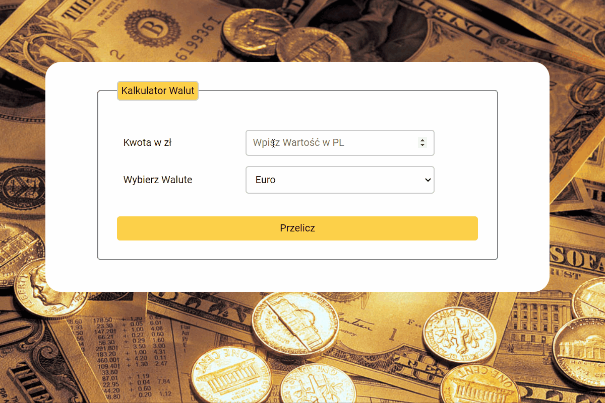

# Exchange Currency
create by Bartosz Hendrych

https://bartoszhendrych.github.io/Currency-Exchange/

## Description 

"Currency Exchange" is a tool that enables users to convert amounts from one currency to another.

### Simple instruction: 

1. Currency selection: Users can choose four currencies they want to compare or convert between. For example, they may select Polish Zloty (PLN) and Euro (EUR).

2. Input of amount: Users input the amount they want to convert from one currency to another. For instance, they may enter 100 PLN.

3. Display of result: The calculator calculates the equivalent value of the converted amount in the chosen currency and presents the result to the user.

Presentation below:

### Technology I used to create exchange currency:
- HTML
- CSS
- JavaScript
- Convection BEM
 
